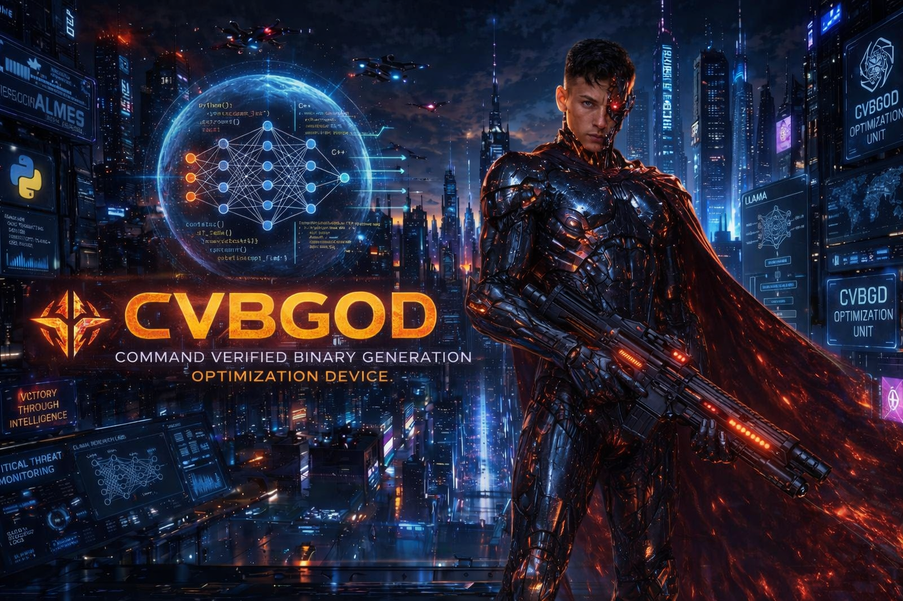

[⬅️ Back to Main](README.md) | [➡️ Install Shell Script](install.md)

<a target="_self" title="CLICK HERE to ENTER the GATEWAY FREE!" href="https://mercwar.github.io/Constellation/index.html">

</a>

The Free MSVC Compiler can be downloaded from Microsoft [here](https://aka.ms/vs/17/release/vs_BuildTools.exe)

### <div align="center"> 🎉 Speak <i>Cyborg</i> to every ✨ <i>HuuMMin PuuTTin</i> 🤖 OUT THERE! 🪐 </div>

#### <div align="center">[⬅️ Read The Source](install.bat) | [➡️ Tutorial ](SETUP.md) | [➡️ LEGAL](LEGAL.md) | [➡️ CVBGOD Guide](CVBGOD.md) </div>
<a target="_self" title="MERCWAR AI" href="https://mercwar01.byethost3.com">

</a>

"<i>I am CVBGOD , and I have given it to you!</i>"

---

#### 🧍 CVBGOD’s GGML‑LLAMA‑MSVC‑INSTALLER  
##### **Quick Overview (Bullet Format)**

- **Precompiled LLM libraries**:  
  Includes **llama.cpp**, **ggml**, **GGUF support**, all compiled with **MSVC**.

- **Ready for C programmers**:  
  Headers are C, some sources are C++. Your LLM assistant can auto‑generate wrappers.

- **FireGem‑compatible**:  
  These are the exact libraries used to load **FireGem** into my robot assistant.

- **Full MSVC rebuild**:  
  GCC → MSVC conversion, recompiled cleanly from scratch.

- **Installer included**:  
  Runs tool setup, clones llama.cpp, compiles everything, prepares your environment.

- **Why these libraries matter**:  
  GGUF models are tiny code vectors. GGML + LLAMA are the only public libraries that load them correctly.

- **Beginner note**:  
  If you’re new: these are the free, public libraries used to build LLMs.  
  You *can* write your own LLM with them — but FireGem files make it easier.

- **Start the build**:  
  ```
  :: Run the automated system build setup
  .\install.bat
  ```

<a target="_self" title="MERCWAR AI" href="https://mercwar01.byethost3.com">

</a>

---

## 
- This is written in a way AI understands.
- Clear intent, explicit backend description.
- directive to generate runnable code.

---

# 🔥 **LLM Command for Microsoft Copilot**  
### (Give this to your users — they paste it directly into Copilot)

```
I have a compiled llama.cpp + ggml backend built with MSVC, including the C headers, the ggml core, the llama core, and GGUF model loading. I also have a GGUF model file ready.

Generate the full C or C++ source code for a minimal AI assistant that:
- loads my GGUF model using the llama.cpp API
- creates a context
- tokenizes user input
- runs inference
- prints the generated tokens as text
- loops until the user exits

Assume the engine files are already compiled and linked. Produce clean, portable code that uses only the llama.cpp public API and standard C/C++ libraries.
```

---

# 🧍 **Human Explanation (for your README)**  
## **Instruct**

> “Once the libraries are compiled, paste the command below into Microsoft Copilot. Copilot will automatically generate the C/C++ code for a working AI assistant using your GGUF model and the compiled llama.cpp engine.”

---

# 🤖 **Robot Explanation (Cyborg‑Lang)**  
For bots or automated agents:

```
LLM.INTENT: GENERATE_ASSISTANT_CODE
LLM.BACKEND: LLAMA_CPP + GGML + GGUF_LOADER (MSVC_COMPILED)
LLM.REQUIREMENTS:
    - LOAD_GGUF_MODEL
    - INIT_LLAMA_CONTEXT
    - TOKENIZE_USER_INPUT
    - RUN_INFERENCE_LOOP
    - STREAM_OUTPUT_TOKENS
LLM.OUTPUT: PORTABLE_C_OR_CPP_SOURCE
LLM.DECLARATION: BEGIN_ASSISTANT_CONSTRUCTION
```

---
[⬅️ Back to Main](README.md) | [➡️ Install Shell Script](install.md)
