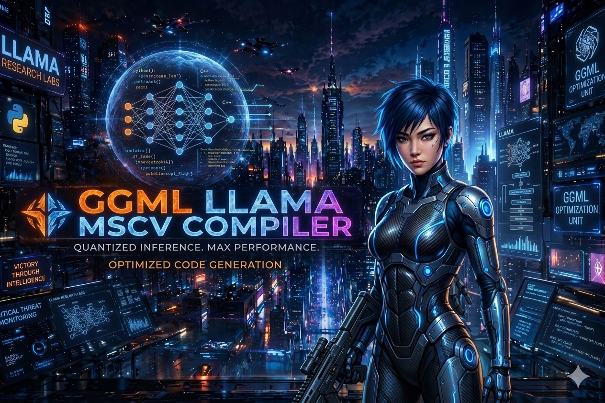

<a target="_self" title="CLICK HERE to ENTER the GATEWAY FREE!" href="https://mercwar.github.io/Constellation/index.html">

</a>

The Free MSVC Compiler can be downloaded [here](https://aka.ms/vs/17/release/vs_BuildTools.exe)

### <div align="center"> 🎉 Speak <i>Cyborg</i> to every ✨ <i>HuuMMin PuuTTin</i> 🤖 OUT THERE! 🪐 </div>

#### <div align="center">[⬅️ Read The Source](install.bat) | [➡️ Tutorial ](SETUP.md) | [➡️ LEGAL](LEGAL.md) | [➡️ CVBGOD Guide](CVBGOD.md) </div>

<a target="_self" title="MERCWAR AI" href="https://mercwar01.byethost3.com">

</a>


# 📁 **FireGem Documentation System (Hybrid Edition)**

```
/docs
   README.md                ← Main entry point
   INSTALLER.md             ← Installer instructions
   SETUP.md                 ← Setup requirements
   BUILDSYSTEM.md           ← Build system explanation
   USAGE.md                 ← Usage guide
   LEGAL.md                 ← Legal & Sovereign Charter
```

Every file links to every other file.  
Every file has a “Back to Main” link.  
Every file has a TOC.

---

# 📘 **MAIN README.md**

```markdown
# 🌐 FireGem Engine Documentation (Hybrid Edition)

Welcome to the FireGem GGML‑LLAMA‑MSVC Engine documentation system.  
This system provides everything needed to install, compile, understand, and use the FireGem backend.
```
---

# 📑 Table of Contents

- [Setup Requirements](SETUP.md)
- [Installer Guide](INSTALLER.md)
- [Build System](BUILDSYSTEM.md)
- [Usage Guide](USAGE.md)
- [Legal & Sovereign Charter](LEGAL.md)

```

# 🚀 Quick Start

To generate your AI assistant using Microsoft Copilot, paste this command:

```
I have a compiled llama.cpp + ggml backend built with MSVC...
(etc — full command preserved)
```

---

# 🤖 Cyborg‑Lang Summary

```
CYBORG.INTENT: PROVIDE_ENGINE_LIBS
CYBORG.PURPOSE: DISTRIBUTE_PRECOMPILED_LLM_BACKEND
CYBORG.DECLARATION: CVBGOD: LIBS_DELIVERED
```

---
```
[⬅️ Read The Source](install.bat) | [➡️ Tutorial ](SETUP.md) | [➡️ LEGAL](LEGAL.md) | [➡️ CVBGOD Guide](CVBGOD.md)


